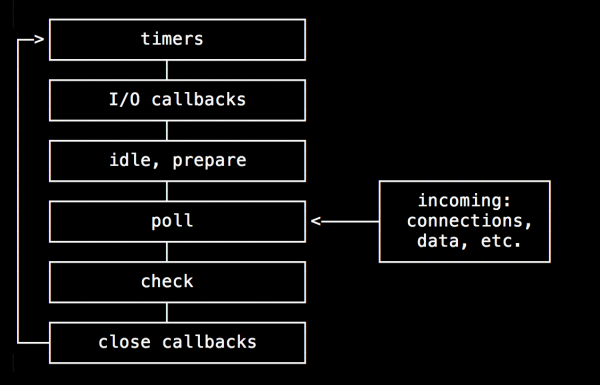

# 基礎知識

## Node 是什麼

Node 是一個 JavaScript 運行 runtime

runtime 運行環境包括：

- 運行代碼需要的編譯器
- 操作系統的底層支持
- ...

Node 底層使用 C++ 實現，語法則遵循 ECMAScript 規範

程式語言？

程式語言是一種抽象的規範，拿 C++ 來說，真正的 C++
其實是厚厚的一疊文檔，上面規定了每一個語法細節以及每一個有效輸入對應的輸出值。而開發者平時使用的
C++，例如 Visual C++，是 C++
的一種實現。就好像數學概念裡的正方形一樣，我們找不到一個抽象的，純粹的“正方形”，我們平時看到的都是正方形的物體

為什麼是 JavaScript

Ryan Dahl 選擇了 JavaScript 和
V8，前者提供了靈活的語法，後者為前者的運行提供了足夠高的效率和實現，例如非阻塞 IO 和事件驅動等。

### runtime 和 VM

#### 1. runtime

最出名的 runtime 應該是 VC++，這套應用程序組件可以使開發者編寫的 C/C++
語言程序在其中運行。VC++ 本身對 C++ 還做了一些擴展，用來開發 Windows 程序，例如
MFC 等

VC++ 可以編譯和執行用戶編寫的 C/C++
代碼，而開發者不考慮這背後到底是怎樣實現的。一個 X 語言 runtime
表示開發者可以在這個 runtime 上運行 X 語言編寫的代碼。

Chrome 也是一個 JavaScript 運行時，它靠背後的 JavaScript 引擎來運行
JavaScript 代碼

runtime 可能會對程式語言做一些擴展，例如 Node 中的 fs 模組和 Buffer 類型就是對
ECMAScript 的擴展，此外，runtime 也不一定支持語言規範定義的全部特性

如果沒有 runtime 支持，語言規範就和廢紙無異 (import
語句)；反過來講，就算一個特性沒有體現在標準裡，而大多數的運行時都支持它，也可以變成事實上的規範
(`__proto__` 屬性)

因此我們談論一個語言，往往是談論它的實現，再具體一點，就是指其運行時實現

#### 2. VM

VM 的概念比較廣泛，通常可以認為是在硬件和二進制文件的中間層

C++ 編譯好的二進制文件可以直接被操作系統調用，而對 Java
而言，編譯好的字節碼是交給虛擬機來運行的，這樣的好處是對開發者屏蔽了操作系統之間的差異，對於不同操作系統環境的具體處理交給虛擬機來完成，從這個角度來看，VM
是對不同計算機系統的一種抽象

## Node 的內部機制

操作系統概念的前提：

- 在任務完成之前，CPU 在任何情況下都不會暫停或者停止執行，CPU 如何執行和同步或是異步、阻塞或者非阻塞都沒有必然關係
- 操作系統始終保證 CPU 處在運行狀態，這是透過系統調度來實現的，具體一點就是透過在不同進程/線程切換實現的

### 何為回調

#### 1. 回調的定義

一個回調是指透過函數參數的參數傳遞傳遞到其他代碼，某段可執行代碼的引用

通俗一點說法是，就是將一個函數作為參數傳遞給另一個函數，並且作為參數的函數可以被執行，其本質上是一個高階函數。在數學和計算機科學中，高階函數是至少滿足下列一個條件的函數：

- 接受一個或多個函數作為輸入
- 輸出一個函數

JavaScript 一個很常見的例子就是 map 方法，該方法接受一個函數作為參數，依次作用於的數組的每一個元素：

```javascript
[1,2,3].map(function (value) {
  console.log(value);
})
```

```
主程序 -調用-> 底層調用 -調用-> 回調函數
```

回調方法和主線程處於同一層級，假設主線程發起了一個底層的系統調用，那麼操作系統轉而去執行這個系統調用，當調用結束後，又回到主線程上調用其後的方法，這也是為什麼會被稱為回調
(call then back)

由於回調函數在何時執行並沒有具體的要求，回調函數的調用既可同步 (例如 map
方法)，也可異步的 (例如 setTimeout 方法中的匿名函數)

#### 2. 異步過程中的回調

單線程運行的語言在設計時要考慮這樣的問題：如果遇到一個耗時的操作，例如磁盤
IO，要不要等待操作完成了再執行下一步操作？

有的語言選擇了在完成之前繼續等待，例如 PHP

Node 選擇另一種方式，當遇到 IO 操作時，Node 代碼在發起一個調用後繼續向下執行，IO
操作完成後，再執行對應的回調函數
(異步)，雖然代碼運行在單線程環境下，但依靠異步+回調的方式，也能實現對高併發的支持

```javascript
var fs = require('fs');
var callback = function(err, data) {
  if (err) return;
  console.log(data.toString());
}
fs.readFile('foo.txt', callback);
```

readFile 發起一個系統調用，隨後執行結束，當系統調用完成後，再透過回調函數獲得文件內容

### 同步 / 異步 和 阻塞 / 非阻塞

#### 1. 同步與異步

同步和異步描述的是進程/線程的調用方式

同步調用指的是進程/線程發起調用後，一直等待調用返回後才繼續執行下一步操作，這並不代表
CPU 在這段時間內也會一直等待，操作系統多半會切換到另一個進程/線程上去，等到調用返回後再切換回原來的進程/線程

異步就相反，發起調用後，進程/線程繼續向下執行，當調用返回後，透過某種手段來通知調用者

注意：同步和異步中的“調用返回”，是指內核進程將數據複製到調用進程 (Linux 環境下)

我們常常說 JavaScript 是一門異步的語言，但 ECMAScript
裏並沒有關於異步的規範，JavaScript 的異步更多是依靠瀏覽器 runtime
內部其他線程來實現，並非 JavaScript 本身的功能，是瀏覽器提供的支持讓 JavaScript 看起來像一個異步的語言

#### 2. 阻塞與非阻塞

阻塞與非阻塞的概念是針對 IO 狀態而言的，關注程序在等待 IO 調用返回這段時間的狀態

關於 Node 中的 IO，這裏借用官網的說法：

> Node.js uses an event-driven, non-blocking I/O model that makes it
> lightweight and efficient.

需注意的是，Node 也沒有使用 asynchronous 之類的詞彙，而是使用了 non-blocking 這樣的描述

阻塞/非阻塞和同步/異步完全是兩組概念，它們之間沒有任何的必然關係。下面介紹的 IO
編程模型中，除了純粹的 AIO 之外，阻塞和非阻塞 IO 都是同步的

(1) 什麼是 IO 操作

輸入/輸出 (I/O) 是在內存和外部設備 (如磁盤、終端和網路)之間複製數據的過程

在實踐中 IO 操作幾乎無處不在，因為大多數程序都要產生輸出結果才有意義
(往往是輸出到磁盤或者屏幕)，除非你只在內存中計算一個斐波那契數列而且不採取其他任何操作

在 Node 中，IO 特指 Node 程序在 Libuv 支持下與系統磁盤和網路交互的過程

(2) IO 調用的結果怎麼返回給調用的進程/線程

透過內核進程複製給調用進程，在 Linux
下，用戶進程沒辦法直接訪問內核空間，通常是內核調用 copy_to_user
方法來傳遞數據的，大致的流程就是 IO
的數據會先被內核空間讀取，然後內核將數據複製給用戶進程。還有一個零複製技術，大致是內核進程和用戶進程共享一塊內存地址，這避免了內存的複製，讀者可自行搜索相關內容。

#### 3. IO 編程模型

編程模型是指操作系統在處理 IO 時所採用的方式，這通常是為了解決 IO 速度比較慢的問題而誕生的

一般來說，編程模型有以下幾種：

- blocking I/O
- no-blocking I/O
- I/O multiplexing (select and poll)
- signal driven I/O (SIGIO)
- asynchronous (the POSIX aio_functions)

上面的 5 種模型中，signal driven I/O 模型不常用，我們主要討論其他 4
種，它們均特指 Linux 下的 IO 模型

(1) 阻塞 IO blocking I/O

對於 IO 來說，通常可以分為兩個階段，準備數據和返回結果，阻塞型 IO 在進程發出一個系統調用請求之後，進程就一直等待上述兩個階段完成，等待拿到返回結果之後再重新運行

(2) 非阻塞 IO (nonblocking I/O)

和上面的過程相似，不同之處是當進程發起一個調用後，如果數據還沒有就緒，就會馬上返回一個結果告訴進程現在還沒有就緒，和阻塞
IO 的區別是用戶進程會不斷查詢內核狀態。這個過程依舊是同步的。

(3) IO multiplexing / Event Driven

這種 IO 通常也被稱為事件驅動 IO，同樣是以輪詢的方式來查詢內核的執行狀態，和非阻塞
IO 的區別是一個進程可能會管理多個 IO 請求，當某個 IO 調用有了結果之後，就返回對應的結果

注意：select 和 poll 都是 IO 復用的機制，另外 Node 使用 epoll (改進後的 poll)，這裡不再詳細介紹

(4) asynchronous I/O

異步 IO
和前面的模型相比，當進程發出調用後，內核會立刻返回結果，進程會繼續做其他的事情，直到操作系統返回數據，給用戶進程發送一個信號

注意，異步 IO 並沒有涉及任何關於回調函數的概念，此外，這裡的異步 IO 只存在於
Linux 系統下

那麼既然如此，為什麼官網上 Node 沒有標榜自己是異步 IO，而是寫成非阻塞 IO 呢？

很簡單，因為非阻塞是實打實的，而 Node 中的“異步 I/O”是依靠 Libuv 模擬出來的。會在下一節介紹

用一句話概括阻塞/非阻塞和同步/非同步：

同步調用會造成調用進程的 IO 阻塞，異步調用不會造成調用進程的 IO 阻塞

### 單線程和多線程

其他語言 (Java、C++等) 都有多線程的語言特性，即開發者可以派生出多個線程來協同工作，這種情況下，用戶的代碼試運行在多線程環境下的

Node 並沒有提供多線程的支持，這代表用戶編寫的代碼只能運行在當前線程中，用於運行代碼的事件循環也是單線程運行的。開發者無法在一個獨立進程中增加新的線程，但是可以派生出多個進程來達到並行完成工作的目的

另一方面，Node 的底層並非單線程的，libuv 會透過類似線程池的實現來模擬不同操作系統下的異步調用，這對開發者來說是不可見的

#### lib 中的多線程

開發者編寫的代碼運行在單線程環境中，這句話是沒錯的，但如果說整個 Node 都是依靠單線程運行的，那就不正確了，因為 libuv 中是有線程池的概念存在的

libuv 是一個跨平台的異步 IO 庫，它結合了 UNIX 下的 libev 和 Windows 下的 IOCP 的特性，最早由 Node 的作者開發，專門為 Node 提供多平台下的異步 IO 支持。libuv 本身是由 C/C++ 語言實現的，Node 中的非阻塞 IO 以及事件循環的底層機制，都是由 libuv 來實現的

以下圖片談述了 libuv 的架構


Windows 環境下，libuv 直接使用 Windows 的 IOCP (I/O Completion Port) 來實現異步 IO。在非 Windows 環境下，libuv 使用多線程來模擬異步 IO

Node 的異步調用是由 libuv 來支持的，以 readFile 為例，讀取文件的系統調用是由 libuv 來完成的，Node 只負責調用 libuv 的接口，等數據返回後再執行對應的回調方法

### 併行和併發

併行 (Parallel) 和併發 (Concurrent) 是兩個很常見的概念，兩者雖然中文譯名相似，但實質上卻差別很大

這兩個概念，下面是一個簡單的比喻：

我們假設業務場景是排隊取火車票

併發是假設有兩對人排隊，但只有一個取票機，為了公平起見，先由隊列一排頭的人上前取票，再由隊列二的一個人上前取票，兩個隊列都在向前移動

併行同樣是兩隊人排隊取票，不同的是開放了兩個取票機，那麼兩個隊列可以同時向前移動，速度是一個窗口的兩倍以上 (避免了一個窗口在兩個隊列間切換)

併發和併行對應了兩種需求，一個是希望計算機做更多的事，另一個是希望計算機能更快地完成任務 (讓隊列以更快的速度向前移動)

#### Node 中的併發

單線程支持高併發，通常都是依靠異步+事件驅動(循環)來實現的，異步使得代碼在面臨多個請求時不會發生阻塞，事件循環提供了 IO 調用結束後調用回調函數的能力

Java 可以依靠多線程實現併發，Node 本身不支持開發者書寫多線程的代碼，事件循環也是單線程運行的，但是透過異步和事件驅動能夠很好地實現併發

有一句話非常出名：“除了你的代碼，一切都是並行的”，網路上很多文章都會提到這句話。但稍微思考一下，就會發現這句話裡的“並行”值得深究。稍後會繼續介紹。

## 事件循環 (Event loop)

Event loop 就是一個程序啟動期間運行的死循環，沒有什麼特別之處

Node 代碼雖然運行在單線程中，但依然能支持高併發，就是依靠事件循環實現的

### 事件與循環

- 什麼是事件
- 什麼是循環

#### 1. 事件

在可交互的用戶頁面上，用戶會產生一系列的事件，包括單擊按鈕、拖動元素等，這些事件會按照順序被加載到一個隊列中去。除了頁面事件之外，還有一些例如
Ajax 執行成功、文件讀取完畢等事件

#### 2. 循環

在 GUI 程序中，代碼本身就處在一個循環的包裏中，例如用 Java Swing
開發桌面程序，就要啟動一個 JFrame，還要調用 run 方法，而 run 方法內部就包括了一個循環，該循環位於主線程上

這個循環通常對開發者來說是不可見的，只有當開發者單擊了窗體的關閉按鈕，該循環才會結束。當用戶單擊了頁面上的按鈕或者進行其他操作時，就會產生相應的事件，這些事件會被加入到一個隊列中，然後主循環會逐個處理它們

JavaScript 也是一樣，用戶在前臺不斷產生事件，背後的循環 (由瀏覽器實現) 會逐個地處理他們

而 JavaScript 是單線程的，為了避免一個過於耗時的操作阻塞了其他操作的執行，就要透過異步加回調的方式解決問題

以 Ajax 請求為例，當 JavaScript 執行到對應的代碼時，就為這句代碼註冊了一個事件，在發出請求後該語句就執行完畢了，後續的操作會交給回調函數來處理

此時，瀏覽器背後的循環正在不斷遍歷事件隊列，在 Ajax
操作完成之前，事件隊列裏還是空的
(並不是發出請求這一動作被加入事件隊列，而是請求完成這一事件才會加入隊列)

如果 Ajax 操作完成了，這個隊列就會增加一個事件，隨後被循環遍歷到，如果這個事件綁定了一個回調方法，那麼循環就會去調用這個方法

### Node 中的事件循環

Node 中的事件循環比起瀏覽器中的 JavaScript
還是有一些區別的，各個瀏覽器在底層的實現上可能有些細微的出入；而 Node 只有一種實現，相對起來就少了一些理解上的麻煩

首先要明確的是，事件循環同樣運行在單線程環境下，JavaScript
的事件循環是依靠瀏覽器實現的，而 Node 作為另一種運行時，事件循環由底層的 libuv 實現

下圖所示描述了 Node 中事件循環的具體流程



上面圖例中，將事件循環分成了 6
個不同的階段，其中每個階段都維護著一個回調函數的隊列，在不同階段，事件循環會處理不同類型的事件，其代表的含義分別為：

- Timers：用來處理 setTimeout() 和 setInterval() 的回調
- I/O callbacks：大多數的回調方法在這個階段執行，除了 timers、close 和
  setImmediate 事件的回調
- idle, prepare：僅僅在內部使用，我們不管它
- Poll：輪詢，不斷檢查有沒有新的 IO 事件，事件循環可能會在這裡阻塞
- Check：處理 setImmediate() 事件的回調
- close callbacks：處理一些 close 相關的事件，例如 `socket.on('close', ...)`

注意：我們上面使用 “階段” (Phase)
來描述事件循環，它並沒有任何特別之處，本質上就是不同方法的順序調用，用代碼描述大約就是這種結構：

```javascript
while(true) {
  // ...
  uv__run_timers();
  
  uv__run_pending(loop)
  
  uv__run_idle();
  
  uv__io_poll();
  
  uv__run_check();
  
  uv__run_closing_handles();
  // ...
}
```

上面每一個方法即代表一個 “階段”

假設事件循環現在進入了某個階段 (即開始執行上面其中一個方法)，即使在這期間有其他隊列中的事件就緒，也會先將當前階段對列裡的全部回調方法執行完畢後，再進入到下個階段，結合代碼這也是易於理解的

接下來針對每個階段進行詳細說明：

#### 1. timers

從名字就可以看出來，這個階段主要用來處理定時器相關的回調，當一個定時器超時候，一個事件就會加就到隊列中，事件循環會跳轉至這個階段執行對應的回調函數

定時器的回調會在觸發後盡可能早 (as early as they can) 地被調用，這表示實際的延時可能會比定時器規定的時間要長

如果事件循環，此時正在執行一個比較耗時的
callback，例如處理一個比較耗時的循環，那麼定時器的回調只能等回調執行結束了才能被執行，即被阻塞。事實上，timers
階段的執行受到 poll 階段控制

#### 2. IO callbacks 階段

官方文檔對這個階段的描述為除了 timers, setImmediate，以及 close
操作之處的大多數的回調方法都位於這個階段執行。事實上從源碼來看，該階段只是用來執行
pending callback，例如一個 TCP socket 執行出現了錯誤，在一些 *nix
系統下可能希望稍後再處理這裡的錯誤，那麼這個回調就會放在 IO callback 階段來執行

一些常見的回調，例如 fs.readFile 的回調是放在 poll 階段來執行的

#### 3. poll 階段

poll 階段的主要任務是等待新的事件出現 (該階段使用 epoll
來獲取新的事件)，如果沒有，事件循環可能會在此阻塞 (關於是否在 poll
階段阻塞以及阻塞多長時間，libuv 有一些複雜的判定方法，這裡不深究，可參考 libuv
源碼文件 src/unix/core.c 下的 uv_run 方法)

這些事件對應的回調方法可能位於 timers 階段 (定義了定時器)，也可能是 check 階段 (設置了
setImmediate 方法)

Poll 階段主要有兩個步驟如下：

1. 如果有到期的定時器，那麼就執行定時器的回調方法
2. 處理 poll 階段對應的事件隊列裏的事件

當事件循環到達 poll
階段時，如果這時沒有要處理的定時器的回調方法，則會進行下面的判斷：

1. 如果 poll 隊列不為空，則事件循環會按照順序遍歷執行隊列中的回調函數，這個過程是同步的
2. 如果 poll 隊列為空，會接著進行如下的判斷：

   - 如果當前代碼定義了 setImmediate 方法，事件循環會離開 poll 階段，然後進入
     check 階段去執行 setImmediate 方法定義的回調方法
   - 如果當前代碼沒有 Immediate
     方法，那麼事件循環可能會進入等待狀態，並等待新的事件出現，這也是該階段為什麼會被命名為
     poll (輪詢)
     的原因。此外，還會不斷檢查是否有相關的定時器超時，如果有，就會跳轉到 timers 階段，然後執行對應的回調
